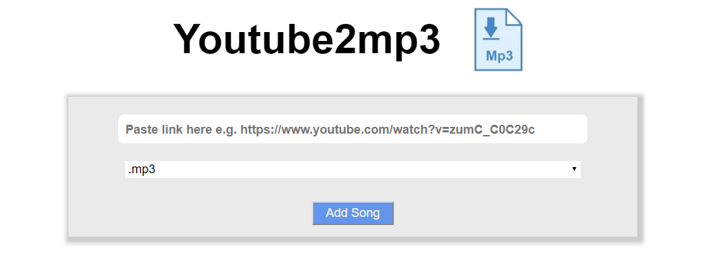

# Youtube2mp3
A simple application that downloads songs from YouTube

and converts them to the desired format, written in react-redux.
 

 
 # Table of Contents

   * [Installation](#installation)
   * [Initialization](#initialization)
 
 
### Installation
Install all server and client dependencies
```
$ cd server
$ npm install
$ cd ../client
$ npm install
```

### Initialization
Start the development server of the react app
```
$ cd server
$ node index.js
$ cd ../client
$ npm start
```
Build the app and Start the server that will serve it
```
$ cd client
$ npm run build
$ cd ../server
$ node index.js
```
